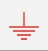

+++
title = "Membuat PCB Project dengan Altium Designer : Membuat Diagram Skematik"
date = 2018-12-06T12:58:00Z
updated = 2019-10-27T22:54:48Z
tags = ["Tutorial", "Altium Designer"]
series = ["Belajar Altium Designer"]
hero = ["/upload/cover-schematic.jpg"]
blogimport = true 
authors = ["Syahrul Fadli"]
aliases = [
    "/membuat-pcb-project-dengan-altium-designer--membuat-diagram-skematik/",
    "/2018/12/membuat-diagram-skematik.html/"
]
+++

 Versi dari *software* **Altium Desginer** yang penulis gunakan **16.0.5**. Pada artikel kali ini Penulis akan menganggap pembaca adalah seorang yang sudah mengerti dasar-dasar elektronika, dan penggunaan sistem operasi Windows. 
 
 ## Membuat Diagram Skematik
 1. Langkah pertama adalah membuat file PCB Project dengan cara Klik "**Files**" lalu pilih "**New**" kemudian pilih "**Project...**."
    
    
    
2. Setelah itu akan muncul jendela baru untuk mengatur file Project yang akan Anda buat. Anda dapat mengatur nama file Project, tipe file Project,lokasi tempat menyimpan file Project. Karena disini kita akan membuat sebuah Project PCB maka untuk "**Project Type**" pilih PCB Project. Lalu klik "**OK**".
    
    
    
3. Setelah itu akan muncul file Project PCB dengan nama yang sudah Anda buat pada langkah sebelumnya. Klik kanan pada nama file Project yang sudah Anda buat lalu pilih "**Add New to Project**" kemudian pilih "**Schematic**".

    

4. Kemudian akan muncul *tab* baru untuk membuat diagram skematik. Hal pertama dalam tahap membuat sebuah Diagram skematik adalah meletakan komponen apa saja yang akan Anda gunakan diagram skematik. Cara mengambil komponen pada *software* Altium adalah sebagai berikut.
       
    * Klik pada tab "**Libraries**". 
       
       
       
    * Pilih *library* dari komponen yang akan Anda gunakan.
        
        
        
    * Setelah memilih *library* komponen yang diinginkan selanjutnya meletakan komponen yang diinginkan dengan cara *drag and drop* pada komponen yang diinginkan atau dengan mengklik satu kali pada komponen yang diinginkan lalu klik "Place (Nama Komponen yang Dipilih)".
        
        
        
        * Jika komponen yang diinginkan tidak ada, Anda dapat *download* file *library* tambahan pada website-website berikut. 
        
            * <a href="https://www.snapeda.com/" rel="nofollow" title="Download library altium">SnapEDA</a> - Website untuk mencari <i>Library</i> dan <i>Datasheet</i> komponen. Libary yang tersedia dalam format PCAD(.lia) untuk itu pengguna harus melakukan import terlebih dahulu. Klik disini untuk cara import PCAD (.lia) ke format yang didukung Altium Designer
        
            * <a href="https://techdocs.altium.com/display/ADOH/Download+Libraries" rel="nofollow" target="_blank" title="Download library altium">Download Libraries - Online Documentation Altium</a> - Website resmi dokumentasi Altium namun sudah lama dan tidak  lagi mendapat pembaruan lebih lanjut.
        
            * <a href="https://designcontent.live.altium.com/" rel="nofollow" title="Download library altium">Altium Deisgn Content</a> - Bentuk pembaruan dari halaman Download Libraries - Online Documentation Altium.
            
    
        
    * Letakan juga <i>Power Port</i> simbol seperti <i>Ground</i> dan <i>VCC</i>. Klik ikon GND  untuk menambahkan ground. Klik ikon VCC  untuk menambahkan simbol VCC
        
        
        
5. Setelah semua komponen diletakan tahap selanjutnya adalah menghubungkan setiap pin/kaki komponen dengan **Wire** .

    
    
6. Jangan lupa berikan nilai komponen seperti kapasitor, resistor dan Kristal dengan cara:
    * Klik dua kali pada komponen dipilih.
    
        
    
    * Pada kolom "**Value**" ubah nilai sesuai keinginan.
    
    
    
    * Klik "**OK**"

7. Tahap Terakhir adalah pemberian nama **Designator** pada masing-masing komponen, [Apa itu Designator? klik disini untuk mengetahuinya](#designator)  .Pemberian nama <i>Designator</i> bisa dilakukan secara manual ataupun otomatis.
    
    * **Cara Manual**
        - Klik dua kali pada komponen yang akan diatur *designator*-nya. Maka akan muncul jendela baru.
        - Pada kolom "**Designator**" ganti isinya, misalnya pada komponen resistor ganti **R?** dengan **R5**. Ingat, jangan ada komponen yang memilki nama *Designator* yang sama.  
            
        - Klik "<b>OK</b>".
        
    * **Cara Otomatis**
        - Klik "**Tools**" kemudian pilih "**Annotate Schematic...**".
        
        - Klik "**Update Changes List**". Setelah itu akan muncul jendela *dialog box* yang menunjukan jumlah perubahan yang dilakukan klik saja "**OK**".
        
        - Setelah itu klik "**Accept Changes (Create ECO)**".
        
        - Maka akan muncul jendela baru. Klik "**Validate**" untuk mengecek apakah ada kesalahan dalam skematik.
        
        - Kemudian itu klik "**Execute Changes**" untuk menerapkan perubahan.
        
        - Tutup jendela dengan klik "<b>Close</b>" dan lihat hasil diagram skematik Anda setelah diberi Designator.

## Tambahan
### Rotasi komponen
Untuk me-rotasi komponen caranya klik satu kalo pada komponen yang akan di rotasi lalu tekan <kbd><kbd>SPASI</kbd></kbd>.

### *Mirror* Komponen
Untuk melakukan <i>mirror</i> caranya adalah dengan klik satu kali pada komponen lalu tahan kemudian tekan tombol <kbd><kbd>X</kbd></kbd>.

<h3 id="designator">Designator pada Altium</h3>

Apa itu <i>Designator</i> pada Altium? <i>Designator</i> adalah paramater pada sebuah komponen yang berfungsi untuk mengidentifikasi dan membedakan simbol komponen tersebut, karena fungsinya untuk membedakan maka nama designator pada tiap komponen harus berbeda. <i>Desginator</i> juga berguna saat pembuatan Layout PCB. Untuk contoh yang dimaksud <i>Designator</i> bisa melihat gambar dibawah ini.



Sekian tutorial dari saya semoga bermanfaat.